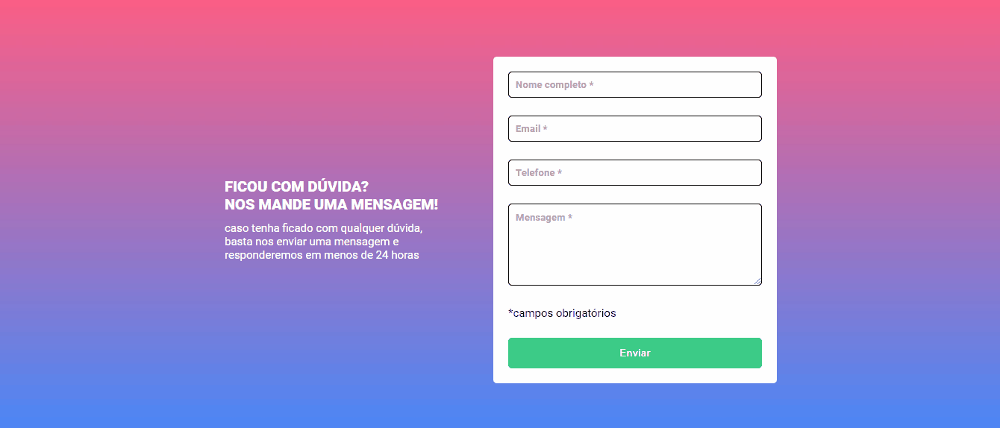

# Formulário com Validação

O desafio consistia em marcar os campos em vermelho caso o usuário tentasse enviar o formulário sem preenchimento nos campos obrigatórios.

## Implementação

Validação do formulário feita com JavaScript. A estrutura semântica foi construída utilizando HTML e a estilização foi implementada com CSS.

Além da funcionalidade solicitada no desafio, foram adicionadas melhorias na validação dos campos e antes mesmo do envio do formulário, os campos preenchidos são destacados em verde para proporcionar uma experiência mais dinâmica ao usuário. Isso foi alcançado através de uma lógica adicional no arquivo JavaScript.

## Deploy

[Link do formulário](https://als-samara.github.io/formulario-com-validacao/)
